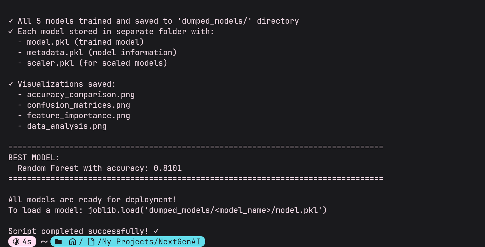
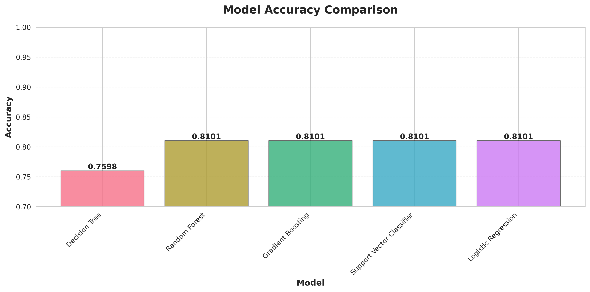
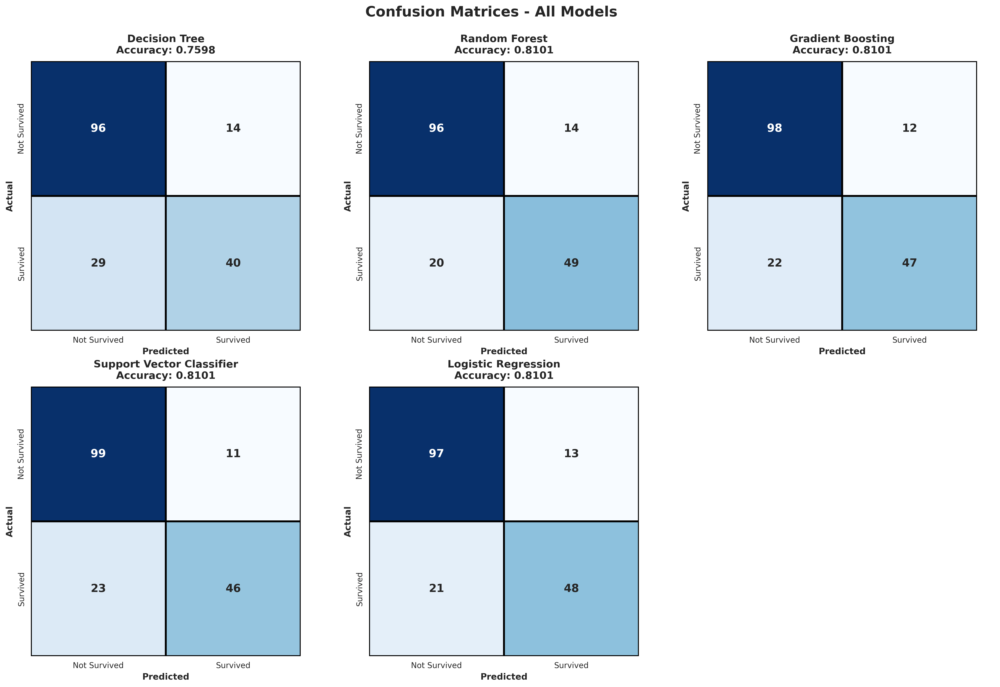
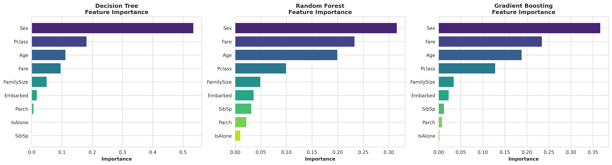
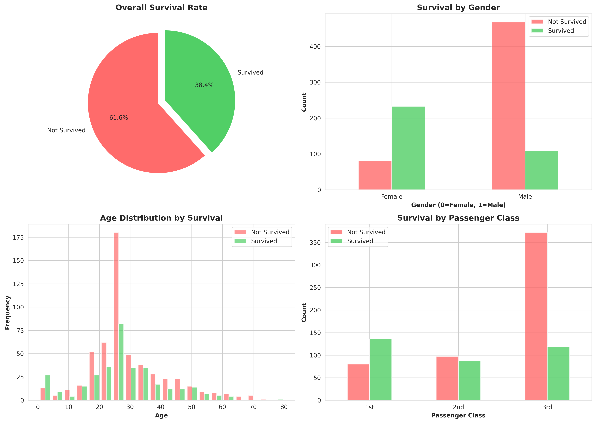

# 🚢 Titanic Survival Prediction - ML Model Comparison

<div align="center">


*A comprehensive machine learning project comparing 5 different algorithms to predict Titanic passenger survival*

[Features](#-features) • [Installation](#-installation) • [Usage](#-usage) • [Results](#-results) • [Models](#-models)

</div>

---

## 📋 Table of Contents

- [Overview](#-overview)
- [Features](#-features)
- [Installation](#-installation)
- [Quick Start](#-quick-start)
- [Project Structure](#-project-structure)
- [Models](#-models)
- [Results](#-results)
- [Visualizations](#-visualizations)
- [Technical Details](#-technical-details)
- [Contributing](#-contributing)
- [License](#-license)

---

## 🌟 Overview

This project implements and compares **5 different machine learning algorithms** to predict passenger survival on the Titanic. The implementation includes comprehensive data preprocessing, feature engineering, model training, evaluation, and beautiful visualizations.

### Why This Project?

- 🎯 **Complete ML Pipeline**: From raw data to deployed models
- 📊 **Multiple Algorithms**: Compare different approaches
- 🎨 **Rich Visualizations**: Understand data and model performance
- 💾 **Model Persistence**: Save and reuse trained models
- 🚀 **Production Ready**: Clean, documented, and optimized code

---

## ✨ Features

### 🤖 Machine Learning Models
- **Decision Tree** - Interpretable tree-based classification
- **Random Forest** - Ensemble of decision trees
- **Gradient Boosting** - Sequential ensemble learning
- **Support Vector Classifier** - Kernel-based classification
- **Logistic Regression** - Linear probabilistic model

### 🔧 Data Processing
- ✅ Intelligent missing value imputation
- ✅ Feature engineering (FamilySize, IsAlone)
- ✅ Categorical encoding
- ✅ Feature scaling for appropriate models
- ✅ Stratified train-test split

### 📈 Visualizations
- Accuracy comparison across all models
- Confusion matrices for each model
- Feature importance analysis
- Data distribution insights

### 💾 Model Persistence
- Each model saved in separate directory
- Includes model, scaler, and metadata
- Easy to load and deploy

---

## 🚀 Installation

### Prerequisites
- Python 3.10 or 3.11 (recommended)
- pip package manager
- 16GB RAM (recommended)

### Step 1: Clone Repository
```bash
git clone <your-repo-url>
cd titanic-ml-project
```

### Step 2: Create Virtual Environment
```bash
# Create virtual environment
python -m venv titanic_env

# Activate (Windows)
titanic_env\Scripts\activate

# Activate (macOS/Linux)
source titanic_env/bin/activate
```

### Step 3: Install Dependencies
```bash
pip install --upgrade pip
pip install -r requirements.txt
```

### Step 4: Download Dataset
Download the Titanic dataset from [Kaggle](https://www.kaggle.com/datasets/yasserh/titanic-dataset) and place `Titanic-Dataset.csv` in the project root.

---

## 🎯 Quick Start

### Train All Models
```bash
python titanic_training.py
```

### Expected Output
```
================================================================================
TITANIC DATASET - ML MODEL TRAINING
================================================================================

[1/7] Loading dataset from: Titanic-Dataset.csv
[2/7] Preprocessing data...
[3/7] Creating model directories...
[4/7] Training models...
[5/7] Model Comparison
[6/7] Generating visualizations...
[7/7] Training Complete!
```

### Load a Trained Model
```python
import joblib

# Load model
model = joblib.load('dumped_models/random_forest/model.pkl')

# Load metadata
metadata = joblib.load('dumped_models/random_forest/metadata.pkl')

# Make predictions
predictions = model.predict(X_new)
```

---

## 📁 Project Structure

```
titanic-ml-project/
│
├── titanic_training.py          # Main training script
├── requirements.txt              # Python dependencies
├── Titanic-Dataset.csv          # Dataset (download separately)
├── README.md                    # This file
│
├── dumped_models/               # Saved models directory
│   ├── decision_tree/
│   │   ├── model.pkl
│   │   ├── metadata.pkl
│   │   └── scaler.pkl (if applicable)
│   ├── random_forest/
│   ├── gradient_boosting/
│   ├── svc/
│   └── logistic_regression/
│
└── Assets/                      # Generated visualizations
    ├── accuracy_comparison.png
    ├── confusion_matrices.png
    ├── feature_importance.png
    ├── data_analysis.png
    └── Code_Run.png
```

---

## 🤖 Models

### Model Configurations

| Model | Type | Key Parameters | Scaled Data |
|-------|------|----------------|-------------|
| **Decision Tree** | Tree-based | `max_depth=5` | ❌ No |
| **Random Forest** | Ensemble | `n_estimators=100, max_depth=10` | ❌ No |
| **Gradient Boosting** | Ensemble | `n_estimators=100, max_depth=5` | ❌ No |
| **SVC** | Kernel-based | `kernel='rbf'` | ✅ Yes |
| **Logistic Regression** | Linear | `max_iter=1000` | ✅ Yes |

### Features Used
```python
['Pclass', 'Sex', 'Age', 'SibSp', 'Parch', 'Fare', 'Embarked', 'FamilySize', 'IsAlone']
```

---

## 📊 Results

### Training Execution

*Training process showing all 5 models being trained and saved*

### Model Performance Comparison

*Bar chart comparing accuracy scores across all models*

### Confusion Matrices

*Detailed confusion matrices for each model showing true/false positives and negatives*

### Feature Importance Analysis

*Feature importance rankings for tree-based models (Decision Tree, Random Forest, Gradient Boosting)*

### Data Distribution Insights

*Comprehensive analysis showing survival rates by gender, age, and passenger class*

---

## 🔬 Technical Details

### Data Preprocessing Pipeline

1. **Missing Value Handling**
   - Age: Filled with median
   - Embarked: Filled with mode
   - Fare: Filled with median
   - Cabin: Dropped (too many missing values)

2. **Feature Engineering**
   - `FamilySize = SibSp + Parch + 1`
   - `IsAlone = (FamilySize == 1)`

3. **Encoding**
   - Sex: Label encoding (0/1)
   - Embarked: Label encoding (0/1/2)

4. **Scaling**
   - StandardScaler for SVC and Logistic Regression
   - No scaling for tree-based models

### Model Training Strategy

- **Train-Test Split**: 80-20 with stratification
- **Random State**: 42 (for reproducibility)
- **Cross-Validation**: Stratified split ensures balanced classes
- **Optimization**: Suitable for non-GPU environments (16GB RAM, Core i5)

### Performance Metrics

Each model is evaluated using:
- ✅ **Accuracy Score**: Overall correctness
- ✅ **Confusion Matrix**: True/False positives and negatives
- ✅ **Classification Report**: Precision, recall, F1-score

---

## 🛠️ System Requirements

### Minimum Requirements
- **CPU**: Intel Core i3 or equivalent
- **RAM**: 8GB
- **Storage**: 2GB free space
- **OS**: Windows 10/11, macOS 10.14+, Linux

### Recommended Requirements
- **CPU**: Intel Core i5 or better
- **RAM**: 16GB
- **Storage**: 5GB free space
- **GPU**: Not required (CPU-optimized)

---

## 🎨 Customization

### Modify Model Parameters
```python
# In titanic_training.py, edit models_info dictionary
'random_forest': {
    'name': 'Random Forest',
    'model': RandomForestClassifier(
        n_estimators=200,  # Increase trees
        max_depth=15,      # Deeper trees
        random_state=42
    ),
    'scaled': False
}
```

### Add New Features
```python
# Add custom features in preprocessing section
df['Title'] = df['Name'].str.extract(' ([A-Za-z]+)\.', expand=False)
df['AgeGroup'] = pd.cut(df['Age'], bins=[0, 12, 18, 35, 60, 100])
```

### Change Visualization Style
```python
# Modify seaborn style
sns.set_style("darkgrid")  # or "dark", "ticks", "white"
sns.set_palette("husl")    # or "Set2", "pastel", etc.
```

---

## 📚 Dependencies

| Package | Version | Purpose |
|---------|---------|---------|
| pandas | 2.0.3 | Data manipulation |
| numpy | 1.24.3 | Numerical computing |
| scikit-learn | 1.3.0 | Machine learning |
| matplotlib | 3.7.2 | Plotting |
| seaborn | 0.12.2 | Statistical visualization |
| joblib | 1.3.2 | Model persistence |

---

## 🤝 Contributing

Contributions are welcome! Here's how you can help:

1. 🍴 Fork the repository
2. 🔧 Create a feature branch (`git checkout -b feature/AmazingFeature`)
3. 💾 Commit your changes (`git commit -m 'Add some AmazingFeature'`)
4. 📤 Push to the branch (`git push origin feature/AmazingFeature`)
5. 🎉 Open a Pull Request

### Ideas for Contributions
- Add more ML algorithms (XGBoost, LightGBM, Neural Networks)
- Implement hyperparameter tuning (GridSearchCV, RandomizedSearchCV)
- Add cross-validation scores
- Create interactive visualizations (Plotly, Dash)
- Develop a web interface (Flask, Streamlit)
- Add model interpretability (SHAP, LIME)

---

## 📝 License

This project is licensed under the MIT License - see the [LICENSE](LICENSE) file for details.

---

## 🙏 Acknowledgments

- **Dataset**: [Kaggle Titanic Dataset](https://www.kaggle.com/datasets/yasserh/titanic-dataset)
- **Libraries**: scikit-learn, pandas, matplotlib, seaborn
- **Inspiration**: Kaggle Titanic Competition

---

## 📞 Contact

Have questions or suggestions? Feel free to reach out!

- 📧 Email: bhattacharyarimil80@gmail.com
- 💼 LinkedIn: [Rimil Bhattacharya](www.linkedin.com/in/rimilbhattacharya)
- 🐙 GitHub: [@rimil0bx](https://github.com/RIMIL08X)

---

<div align="center">

### ⭐ Star this repository if you found it helpful!

Made with ❤️ and Python

</div>
